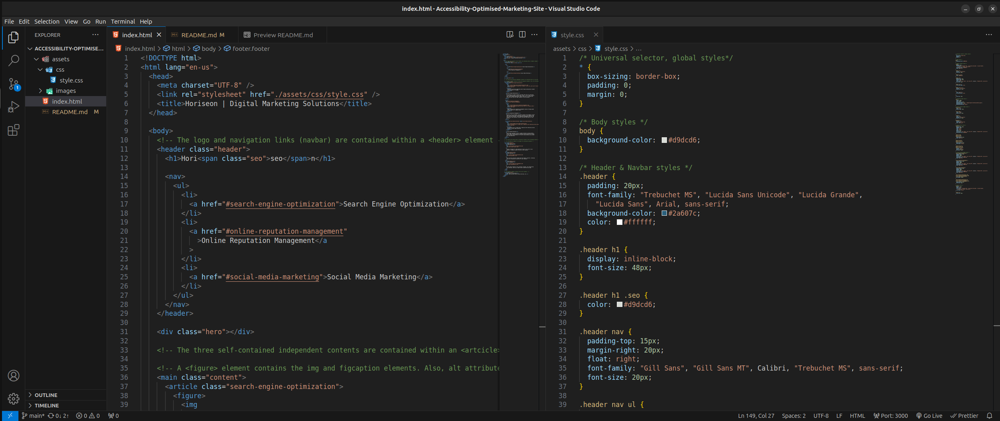

# 01 HTML, CSS, and Git: Code Refactor

## Introduction

Semantic HTML is used to organise content on a webpage by providing meaning and strucutre to the different parts of the page.

Instead of using generic divs to layout content, semantic HTML introduces elements such as `<header>, <nav>, <section>, <article>, <aside>, <footer>` and so on. Each element has a specific semantic meaning.

They not only help in organising content for better readability and maintainabilty but also provides valuable infomtion to search engines, accessibility tools, and other devices like screen readers, allowing them to understand the structure and purpose of different parts of the web page.

## Live Demo

To visit the live website, <a href="https://a-mohamed14.github.io/Accessibility-Optimised-Marketing-Site/">click here</a>

## Project Overview

This repository contains the codebase for the website of a marketing agency, Horiseon. The goal of this project is to refactor the exisiting code - without changing the design and functionality of the web page - to ensure that the website meets accessibility standards and is optimised for search engines.

## Key Features And Accomplishments

- Update the title element to provide a concise and descriptive title, enhancing the overall user experience and search engine optimisation (SEO).

- Include semantic HTML elements such as `<header>, <nav>, <article> and <footer>` to improve accessibility and provide a clearer strucure.

- Add alt attributes and figcaptions to all images and icons to ensure accessibilty for users with disabilities and improve SEO.

- Adjust CSS selector classes to target the correct refactored HTML tags.

- Condense multiple class selectors in CSS to minimise duplication.

## Website Preview

## Code Preview

